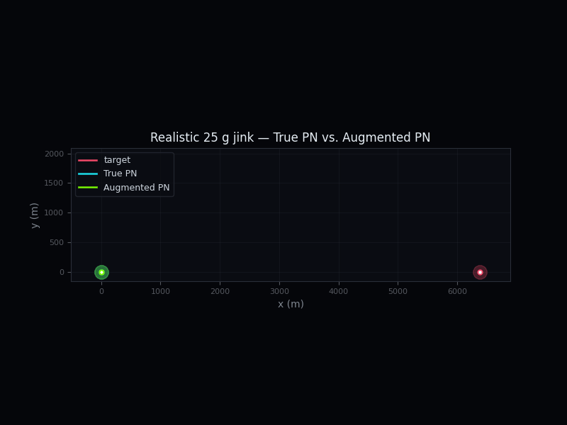
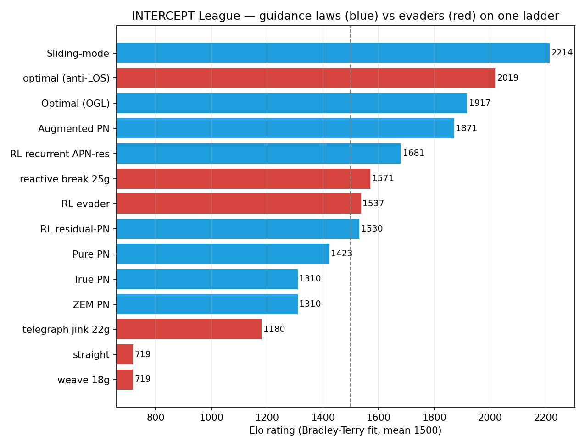
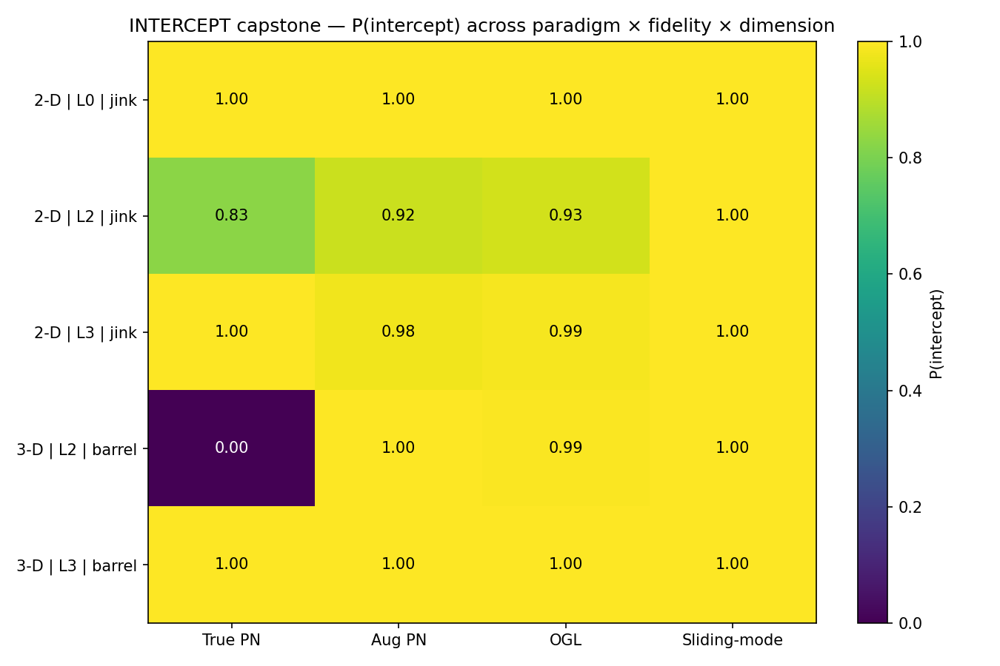
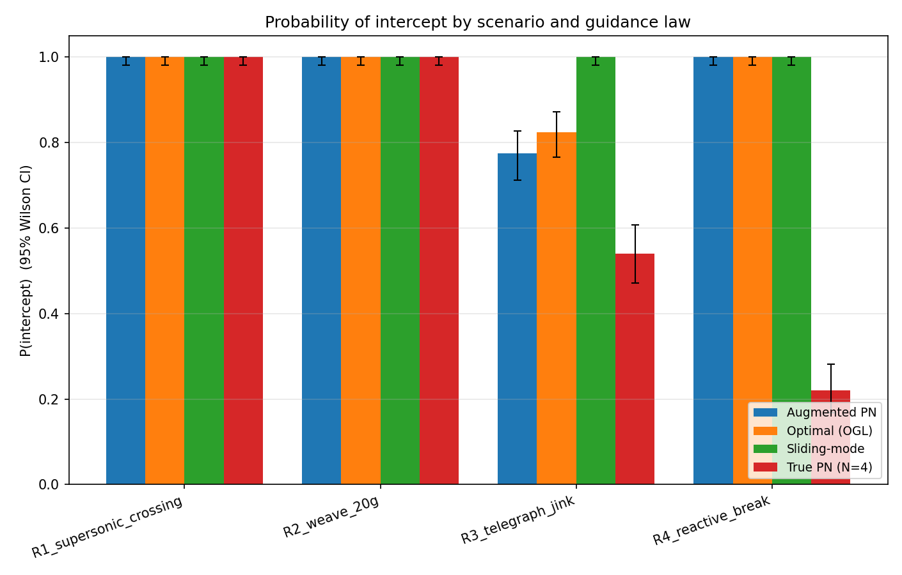
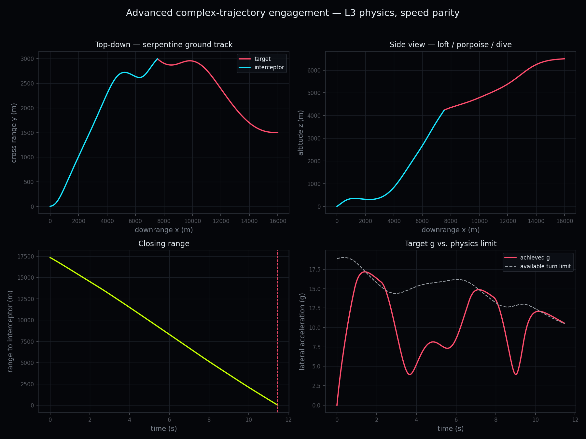
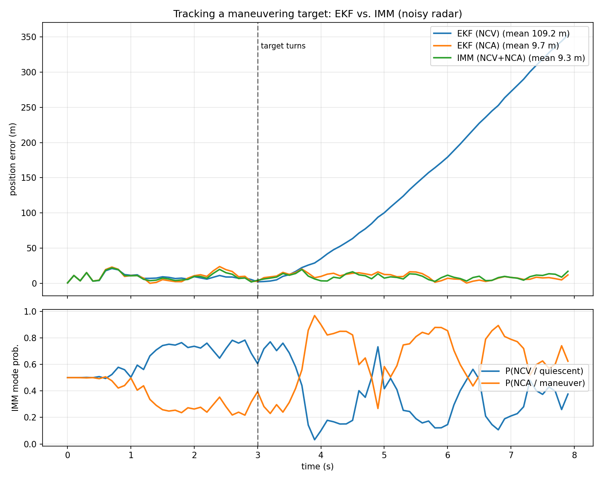
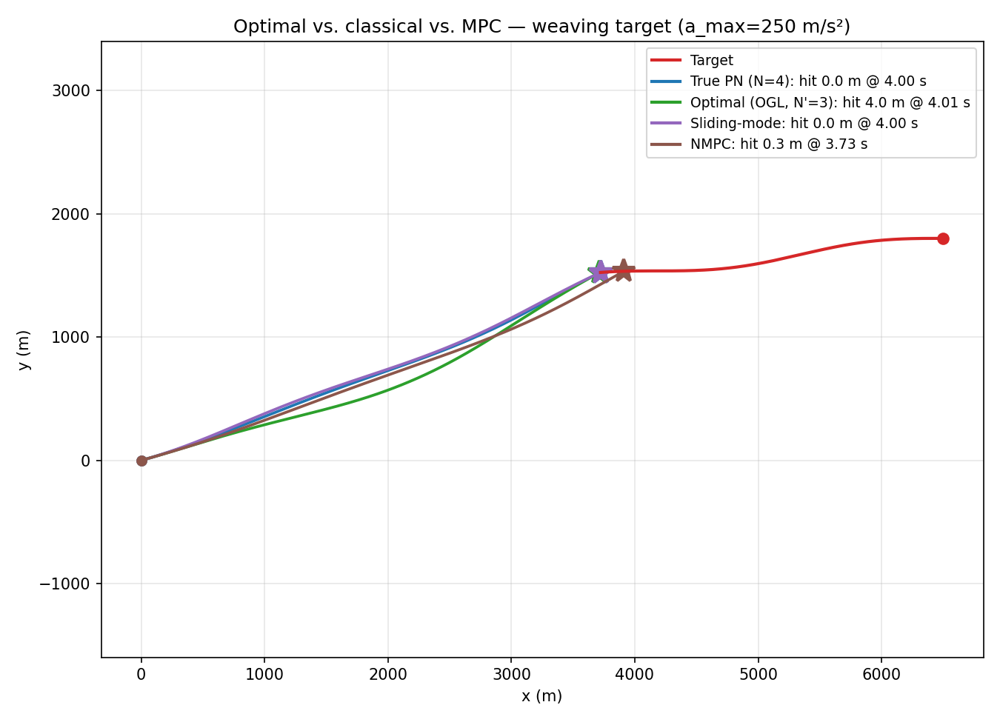

# INTERCEPT

<p align="left">
  
  
  
  
  
  
  
  <!-- Once the repository is on GitHub, enable the live CI badge:
  [](https://github.com/Manas-arumalla/intercept/actions/workflows/ci.yml) -->
</p>

**A research-grade, reproducible benchmark that puts classical, optimal, game-theoretic, and
learned missile-interception guidance on the *same field*** — identical dynamics, a shared scenario
suite, shared metrics, and full seeded Monte-Carlo statistics.

I built INTERCEPT to answer a question the literature leaves scattered: *on equal footing, which
guidance paradigm actually wins, and at what cost?* Every guidance law, evader, and allocator here
runs against the same physics, so every difference you see is the algorithm — not the testbed.

> **Scope & ethics.** INTERCEPT is a **simulation-only, educational/research** project. It uses
> point-mass / kinematic models and public, textbook-level guidance, estimation, and control
> algorithms (Zarchan, Siouris, Shneydor, Bar-Shalom, Isaacs). It contains **no hardware
> integration, no real targeting or sensor data, no munitions/warhead modeling, and no
> detection-evasion tooling**. The goal is to study and *compare guidance and autonomy algorithms*
> as a controls/robotics research and teaching artifact.

<p align="center">
  
  
</p>

---

## 🏆 The INTERCEPT League — Elo ratings for guidance laws

A benchmark framing I haven't seen elsewhere: every seeded engagement is a **match** (intercept ⇒
the guidance law wins; escape ⇒ the evader wins), and a **Bradley-Terry fit** over the full
round-robin — every law vs every adversary on identical dynamics — puts *both sides on one Elo
ladder*. It is, as far as I can find in the literature, the first skill-rating ladder for guidance
laws.

<p align="center">
  
</p>

| rank | participant | side | Elo |
|---|---|---|---|
| 1 | **Sliding-mode** | guidance | **2214** |
| 2 | optimal (anti-LOS) | *evader* | 2019 |
| 3 | Optimal (OGL) | guidance | 1917 |
| 4 | Augmented PN | guidance | 1871 |
| 5 | RL recurrent APN-residual | guidance | 1681 |
| … | *(full 14-row ladder: `results/p32_league.md`)* | | |

The ladder says in one glance what a dozen separate tables could not: **robustness (sliding-mode)
wins the league**, the **game-theoretic evader out-rates every other guidance law** (a *target* is
the #2 player overall), learned laws sit mid-table, and scripted evaders fall to the bottom. The fit
also predicts unplayed match-ups (`elo_expected_score`). Reproduce: `python experiments/p32_league.py`.

## Why this project

Comparisons between guidance paradigms — Proportional Navigation, optimal/geometric laws,
differential-game strategies, and reinforcement learning — are scattered across single studies on
*different* geometries and metrics, and most report only miss distance (ignoring control
effort/efficiency, where learned methods often win). I could not find a clean, reproducible
open-source benchmark that puts these paradigms on the same field, so I built one.

The design invariant that makes the comparison valid: **every controller — guidance law, scripted
or RL evader, swarm allocator — is the same callable contract `(t, own_state, world) -> control` and
shares the *same* injected dynamics.** No method gets a physics advantage; differences are the
algorithm, not the testbed.

## What's built

Across six paradigms, three fidelity levels, 2-D and 3-D, single- and many-vs-many:

| Layer | Implemented |
|---|---|
| **Guidance (9 laws / 6 paradigms)** | Pure / True / ZEM Proportional Navigation · Augmented PN · Optimal LQ/ZEM (OGL) · Sliding-Mode · NMPC (CasADi/IPOPT, impact-angle, event-triggered) · RL (PPO) · Apollonius-circle geometric pursuit |
| **Fidelity ladder (L0→L3)** | `PointMass2D/3D` → `AeroMissile2D/3D` (gravity, parasitic + induced drag, g-limit, autopilot lag) → `RealisticMissile2D/3D` (ISA atmosphere, boost–sustain–coast propulsion + mass burn-off, Mach + induced drag, **lift / dynamic-pressure-limited turning** — turn capability emerges from physics, not a prescribed limit) |
| **Estimation & sensing** | Radar (range+bearing) & IR (angles-only) sensors with seeded noise · EKF (Joseph) · UKF · IMM · sense→estimate→guide closure |
| **Game theory & adversaries** | Apollonius dominance geometry · game-theoretic optimal (anti-LOS) evader · scripted weave/jink/bang-bang · reactive max-g break · 3-D barrel-roll / serpentine / **intensifying terminal spiral** |
| **Multi-agent** | Hungarian weapon-target assignment · N-vs-M area defense with live re-assignment · diverse-threat swarm raid (6 realistic trajectory profiles) · **learned (MARL) cooperative allocation** · **coordinated swarm-penetration tactics (time-on-target / decoy-screen / saturation-point / waves) + asset-value layered-defense counter** |
| **Benchmark** | YAML scenario suite (2-D **and** 3-D) · seeded Monte-Carlo (fairness invariant) · Wilson-CI metrics · **paired-bootstrap significance** · capture-region sweeps · publication-quality figures + animations |

**199 unit/property/regression tests passing · `ruff`-clean · fully type-hinted (`mypy` runs in CI).**

## Headline results

- **Intelligence beats speed.** On realistic evasive engagements, simple True PN collapses to
  **P(intercept) 0.21–0.56** (reactive break / unpredictable jink), while **Augmented PN, Optimal,
  and Sliding-Mode recover to 0.79–1.00** — prediction and robustness, not a speed margin.
- **Speed parity, no artificial edge.** Both missiles run on the full L3 plant; a ~Mach 3 threat
  flies a lofted serpentine + intensifying terminal spiral, and the interceptor wins with only a
  **+37 % closing-speed margin** — a propulsion sweep confirms that shrinking its motor turns the win
  into a *miss*, so the result is an algorithm win, not a thrust advantage. **60/60 robustness
  intercept** across randomized geometry and maneuver parameters (P = 1.00, 95 % CI [0.94, 1.00]).
- **Estimation matters.** Against a maneuvering target, an IMM filter holds **~9 m** tracking error
  where a single-model EKF diverges to **~350 m**.
- **Area defense.** 8 interceptors vs an 8-threat fan → **8/8 intercepted, 0 leakers** via Hungarian
  WTA with re-assignment; scaled up, a two-wave 12-threat raid is fully defeated **12/12**.
- **Beating a decoy-screen saturation raid.** Against a coordinated raid that screens real threats
  with decoys, a naive time-minimizing defender wastes its magazine on chaff (**1.7 real leakers**);
  my **asset-value defense** — impact-point prediction plus a track-history decoy discriminator —
  spends every interceptor on real threats (**0.0 leakers**), and breaks even with the naive defender
  when there are no decoys to exploit — discrimination helps exactly where it should.
- **Learned vs classical, at speed parity.** With the interceptor only ~1.45× the target, *from-
  scratch* PPO collapses — so the policy instead learns a **residual** on a PN baseline, matching the
  classical laws (head-on / weave **1.00**) and edging them on the crossing shot (**0.82 vs 0.76**)
  at higher control effort. A clean, reproducible learned-vs-classical comparison with the cost
  reported alongside the win.
- **A learned guidance law that outperforms the PN family.** From-scratch PPO *collapses* on the
  realistic (lagged + gravity) plant (~0–2 %). The **residual** parameterization — a bounded
  correction on a PN/APN baseline ([ADR-0011](docs/adr/0011-residual-rl-guidance.md)) — restores it,
  and with an **APN baseline + a recurrent (LSTM) policy** it reaches **1.00 / 1.00 / 0.95**
  (crossing / weave / jink). On the unpredictable jink it **beats True PN (0.81) and Augmented PN
  (0.93)** at lower effort, trailing only sliding-mode (1.00) — a genuine learned win on the hardest
  realistic case.
- **One fair benchmark, statistically grounded.** The same seeded harness spans **paradigm ×
  fidelity (L0→L3) × dimension (2-D/3-D)**; pairwise differences use a **paired bootstrap** (the
  fairness invariant makes trials paired). E.g. on the 2-D L2 jink, Augmented PN beats True PN by
  **+0.09 (95% CI [+0.03, +0.16], p = 0.009)**; in 3-D a barrel-roll defeats True PN (**0.00**) while
  Augmented PN holds **1.00**.

<p align="center">
  
</p>
<p align="center">
  
  
</p>
<p align="center">
  
  
</p>

## Architecture

```
Scenario (YAML) → Simulation Core (dynamics · RK4 · engagement loop)
   ├── Sensors      → Estimation/Tracking (EKF/UKF/IMM) ┐
   ├── Guidance/Control (PN·APN·OGL·SMG·MPC·RL·Game)    ├→ Engagement → Result/metrics
   └── Adversary (scripted · game-theoretic · RL)        ┘
Experiment & Analysis: Monte-Carlo · benchmark harness · capture-region · viz · RL training
```

An algorithm-agnostic core, plug-in paradigms, and an experiment/analysis layer. The
dimension-agnostic engagement loop runs L0–L3 and 2-D/3-D unchanged. See
[docs/index.md](docs/index.md) and the [Architecture Decision Records](docs/adr/) for the rationale
behind each design choice.

## Quickstart

```bash
pip install -e ".[dev]"                       # core + dev tools (extras: .[rl] .[mpc] .[estimation])
pytest -q                                     # 199 tests
ruff check intercept tests experiments        # lint

python experiments/p2_benchmark.py            # the centerpiece: PN-family Monte-Carlo + figures
python experiments/p8_realistic_benchmark.py  # intelligence-beats-speed on realistic evaders
python experiments/p14_advanced_evasion.py    # L3 complex-trajectory showcase + robustness (speed parity)
python experiments/p35_swarm_penetration.py   # coordinated saturation tactics vs the asset-value defense
python experiments/p9_3d_demo.py              # 3-D engagement + modern animation + interactive HTML
```

Headless plotting (CI/automation): set `MPLBACKEND=Agg`. Experiments write figures to `gallery/`
and CSVs to `results/`.

## Repository layout

```
intercept/   core · guidance · sensors · estimation · multiagent · adversary · envs · benchmark · viz
experiments/ runnable scripts (p0…p35) producing every figure/animation in gallery/
tests/       unit · property · regression (199)
scenarios/   YAML scenario suite (2-D and 3-D)
results/     benchmark CSVs + the League ladder (committed, so the numbers travel with the repo)
gallery/     publication-quality figures + cinematic animations
docs/        index · adr/ (28 decisions) · algorithms/ · benchmarks/ · development log
planning/    research foundation (state of the art) + design document / roadmap
```

## Documentation

A full **mkdocs-material** site (`mkdocs.yml`) collects the docs below; build it locally with
`pip install -e ".[docs]" && mkdocs serve`, or it auto-deploys to GitHub Pages via
`.github/workflows/docs.yml` once the repo is on GitHub. CI (`.github/workflows/ci.yml`) runs
ruff and pytest on Python 3.10–3.12, type-checks with mypy (advisory), and verifies the docs build.

- **Results digest (headline findings + figures):** [docs/results.md](docs/results.md)
- **Scope & limitations (the model's boundaries, stated plainly):** [docs/limitations.md](docs/limitations.md)
- **Research foundation & roadmap:** [planning/00_RESEARCH_REPORT.md](planning/00_RESEARCH_REPORT.md),
  [planning/01_PROJECT_PLAN.md](planning/01_PROJECT_PLAN.md)
- **Algorithm notes (with governing equations + references):** [docs/algorithms/](docs/algorithms/)
- **Benchmark methodology:** [docs/benchmarks/methodology.md](docs/benchmarks/methodology.md)
- **Decisions:** [docs/adr/](docs/adr/) · **Development log:** [docs/progress/PROGRESS.md](docs/progress/PROGRESS.md)

## Tech stack

Python · `numpy` / `scipy` core · `CasADi` + IPOPT (NMPC) · `Gymnasium` + `Stable-Baselines3` (RL) ·
`Matplotlib` (2-D/3-D viz + animations). Optional extras keep the core install light.

## License

[MIT](LICENSE).
